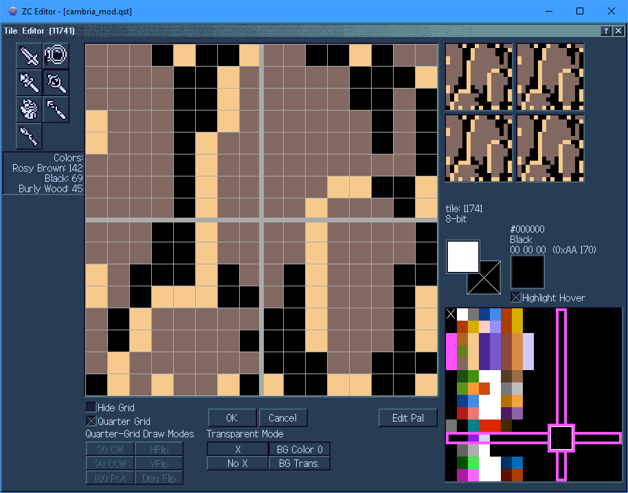

# ZQuest Classic: 2.55 Development Summary
ZQuest Classic has grown by a ***huge*** amount between 2.50.2/2.53 and 2.55 versions. There are many new features, for gameplay, editing, ui, ease-of-use, scripting, and really every possible part of the engine you could imagine. Here, I'm going to go through each feature in some amount of depth to show what's new.

## Editor
### GUI changes
Previously, ZQ had 'Small Mode' and 'Large Mode'. This divide could no longer be feasibly supported, mainly because small mode's base resolution was simply too small to fit the GUI for many of the new features, requiring us to make entirely separate GUIs for small mode, which was simply too much work to keep up. However, numerous users took issue with this from an accessibility standpoint, as the large mode GUI had a lot of spots where text was too small to read for some, among other issues. As such, BOTH of these modes have recieved a giant overhaul, to create a brand new and more customizable GUI.

Pictured above on the left is compact mode, and on the right is expanded mode. The `< Expand` / `> Compact` button in the top bar toggles between these modes. Since both modes use the *exact same window size*, many things can be easily supported between them, including switching without the need to relaunch the entire program. Additionally, there are several other minor toggles that you can use in the GUI.

* The `<|>` / `>|<` button above the combo columns allows you to toggle how many columns show. This toggles between 1/2 in compact, and 2/4 in expanded. Obviously, less columns means they have room to display larger, making them easier to read- while more columns gives you more combos usable at once.
* The `+` / `-` button near the `Favorites` functions similarly, allowing more to be shown at once at the cost of being smaller, or vice-versa.
* The `<` / `>` buttons near the `Favorites` allow you to change *pages*, because there are now multiple pages of favorites. Right-clicking these buttons allows you to jump straight to a specific page.
* The `+` / `-` button near the `Favorite Commands`... also functions similarly, allowing more or less commands to show. Some of the text may be cut off (abbreviated with `...`) if it cannot fit, which is more of a problem when showing more commands- though hovering over a command with tooltips enabled will display a tooltip of the full text.
* The `X` buttons near the `Favorites` and `Favorite Commands` respectively, clear all favorites/favorite commands (with an `Are you sure?` popup to prevent accidental deletion)
* The `SWP` button, *only available in Compact mode*, changes the bottom pane to work more similarly to the old small-mode pane, only displaying one set of: `4 warp return squares`, `item + stairs + green square + flags`, or `screen's enemies` at a time, with up/down arrows to cycle between these 3 panels. (This allows the text here to be larger and more readable, if you find it too small to read otherwise).
* By right-clicking on the minimap, you can *zoom in* on it, making it much larger. While it is zoomed, any click that is not on the minimap will un-zoom, as will pressing `Esc`, or right-clicking again. 
* In `Etc->Options`, you can change what fonts are used by various portions of the program. The default font is larger than it used to be, to improve readability. NOTE: Some older dialog windows will have overlapping text as a result of this, such sections need to be upgraded eventually to be able to handle variable font size, but just haven't been gotten to yet.

### Drawing Modes
Previously, you had to cycle through drawing modes one-by-one using the draw mode button in the upper-right. But now, you can simply right-click on the draw mode button to pop up a selector menu. 

Additionally, you may notice that the available drawing modes have changed.
* Normal drawing mode, for placing combos just as normal.
* Alias drawing mode is mostly unchanged.
* Pool drawing mode is entirely new; combo pools are weighted collections of combos, and when drawn on the screen, a random combo is selected from the pool for each position. This is useful for randomized decorations, like cracked/mossy/etc floor tiles, or variety in flowers/grass. Actions like floodfill (`Ctrl+Click`) work as expected, filling each position with a separately randomized combo. Undo/Redo do not re-randomize, though placing the pool again obviously will. 
* Auto Combo drawing mode has some brand-new features, as well as everything the old `Relational` and `Dungeon Carving` modes had, merged into one mode. This allows you to set up specificly-laid-out sets of combos, and chooses which combos to place smartly based on the surrounding combos on the screen. This can be used to automatically draw entire mountains, lakes, etc, automatically handling the edges/corners for you as you draw. 

### Tileset Loading
Via `File->Load Tileset`, you can start a new quest using an existing tileset. Unlike just using `File->Open`, this method gives you some help setting up a fresh quest. It allows you to clear some aspects of the tileset (maps to remove example screens, scripts to remove packaged scripts, and the header to clear the title/author of the tileset), and then gives you a dialog  that allows you to set some basic things (such as quest rules, the quest header, and map count) for your new quest.

### Quest Rules
Quest Rules used to require swapping between a bunch of different tabs to search for the rules you want; but now you can just search for them! 

Additionally, `Rule Templates` have been added. Unlike `Rulesets`, which set ***every single quest rule***, `Rule Templates` will leave most quest rules alone, and only set **related** quest rules. 

### Tile Editor

The tile editor has been revamped with some new features and options. You can now:
* Hide the grid between pixels
* Show a thick grid splitting the tile into quarters
  * ...and toggle various rotation/reflection modes to simplify drawing
* Toggle the 'X' over transparent pixels
* Toggle between transparent pixels being filled with color 0 or being see-through (showing the dialog color behind the editor pane)
* See what colors (by name) make up a tile (left-hand side)
* Better see what color you are hovering over on the palette (via highlight)
  * ...and see color name of hovered color
* Edit palettes directly from the tile editor

## Player

## Quest Packaging
Via `File->Export->Package`, you can now create a 'package', containing your own custom quest `.exe` and a folder containing everything it needs to run. Running this `.exe` can either run 'standalone' mode for your quest, or the new 'only' mode. 'Only' mode allows you to select save files as normal, except *only your quest* can be played, automatically skipping quest file selection.

## Test Mode
Via `Quest->Test`, you can launch your quest in the player in a 'test' mode. This will spawn you on the screen currently being edited (the editor doesn't know what dmap to use, though it attempts to automatically figure it out for you. If it's wrong you may need to select the dmap manually). In this test launch, there is no save select screen- any action that would send you to the save screen just immediately re-loads the same test file. While in test mode, cheats are automatically enabled to maximum. Additionally, test mode can use a separate Init Data, to spawn with specific items. This mode is designed to make testing specific sections of your quest much easier.

## New Quest Features
There are plenty of new features that can be used in your quests. Some used to be popularly scripted, but are now in engine; others are brand-new ideas that were added. Altogether the focus when adding new features has been to give questmakers all the options we possibly can. This does have the effect of some systems being more difficult to learn, though in most cases we try to aim for "easy to use, difficult to master".

Features below are not listed in any particular order, though I will attempt to group similar features together.
### New Item Types
* `Attack Ring` items increase the damage of swords/wands/hammers (similar to whimsical ring, but 100% of the time)
* [`Bottle Fillers` / `Bottles` / `Bug Nets`](#new-bottles) work together, allowing bottles that can be filled with multiple different types of potions/fairies/etc.
* The `Custom Weapon 01` through `Custom Weapon 10` itemclasses spawn a basic customizable weapon of types `LW_SCRIPT1` through `LW_SCRIPT10` respectively. Especially useful when combined with the new `lweapon script` type.
* `Item Bundle` items can give the player up to 10 other items when collected. Useful for bundling multiple items together, such as a Quiver, Bow, and Arrows.
* `Lantern` items allow the player to give off light in [new dark rooms](#real-dark-rooms)
* `Lift Glove` items allow picking up and throwing combos (and `Bomb` type weapons, optionally) based on settings set in the [new combo `Lifting` tab](#new-combo-features-all-types)
* `Mirrors` allow warping to another dmap at the same screen/x/y position (depending on the dmap) to simulate parallel worlds / time travel / environment shifting type warp effects. They can optionally leave behind a portal to return. If the player tries to warp into a solid or other unsafe situation, the warp will 'bounce' them back. The new `No Mirroring` flag can be placed to prevent using these items in specific spots. Additionally, a dmap can be set to cause a mirror to warp you to the continue point instead of its usual effects.
* `Note` items can be used to display a message string. Especially useful when combined with String Control Codes.
* `Pearls` can prevent you from turning into [a bunny](#bunny-effect) on certain dmaps.
* `Progressive Item`s can be configured with a sequence of up to 10 other items. They will take on the appearance of the first item in their sequence that the player does NOT currently own, and will also grant that item when collected. Especially useful for items intended to be collectible out of sequence, and 'randomizer' style quests.
* `Refiller` items refill a counter when used. (This can be used for things like 'healing spells')
* `SwitchHooks` work mostly identically to hookshots, except instead of grabbing hookable targets and pulling the player towards them, they grab switchable targets and teleport the player and the target, swapping their positions. Enemies with the `(None)` defense are swapped with the player when hit, as well. (The new `Switch w/ Player` defense type can be used to cause this effect when an enemy is hit with other weapon types, as well!)

### Improved Item Types
* `Arrows`
  * Being able to pick up items is a per-arrow flag, instead of tied to a QR
  * Can be set to be able to pick up ANY item (instead of just 'dropped' items)
  * Can be set to specifically be able to pick up any Key type items
  * Max number of arrow weapons that can be onscreen at once is configurable
* `Bait` has several new flags to customize its' use
* `Bombs`/`Super Bombs` have customizable radius, can be set to be liftable by `Lift Glove` items (including optionally having the bomb automatically in your hands when used, instead of placed).
* `Books` have a couple more flags for how they interact with wand magic, and [customizable fire levels](#fire-types)
* `Boomerangs`
  * Similar item pickup settings to `Arrows`
  * Separate settings for `Drags Items` and `Reflects Enemy Projectiles` (shared with `Hookshots` and `SwitchHooks`)
  * [Customizable fire levels](#fire-types)
* `Boots` can be set as `Heavy`, which affects some combo types
* `Bracelets` can have a set use count per screen, instead of once or infinite
* `Candles` can have a custom fire step speed, max fires on screen, and use count per screen (instead of once or infinite). Also has [customizable fire levels](#fire-types).
* `Clocks` can be set to be active-use (equipped to a button) instead of on-pickup.
* `Divine Escape` (previously `Farore's Wind`) can be set to act like F6->Continue when used (which includes the health restore and such)
* `Divine Fire` (previously `Din's Fire`) has [customizable fire levels](#fire-types)
* `Divine Protection` (previously `Nayru's Love`) was renamed
* `Fairies` can be tied to a specific [bottle fill type](#new-bottles) which represents what you catch when using a `Bug Net` on them
* `Flippers` can be customized with custom dive duration, cooldown, dive button, and the ability to press dive again while underwater to 'cancel' and resurface.
* `Hookshots` can (experimentally) shoot diagonally, and have several changes in common with `Boomerangs` related to item pickup and reflecting enemy projectiles.
* `Kill All Enemies` can be set to be active-use (equipped to a button) instead of on-pickup.
* `Lenses` can have their various magical effects toggled separately
* `Peril Rings` can reduce damage by a percentage instead of a divisor for better fine-grained control
* `Rafts` can have customized movement speed
* `Rings` can reduce damage by a percentage instead of a divisor for better fine-grained control
* `Roc Items`
  * Can be set to a hardcoded button(s) from A,B,L,R,Ex1-Ex4
  * Can have multiple 'jumps', allowing jumping a set number of times in mid-air
  * Configurable `Coyote Time`
  * Can use jump power of `Power / 100` instead of `(Power + 2) * 80`, allowing for finer jump height control
  * Has options related to altering gravity/terminal velocity while holding the jump button
* `Shields`
  * can be set to be active-use (equipped to a button) instead of passive.
    * can change player speed while holding shield out
    * can lock player direction (strafe) while holding shield out
  * can protect any combination of the player's 4 sides
    * If set to be active-use, can set separate active and passive sides
* `Stomp Boots` allow bouncing off of enemies, and can also be configured to bounce off of certain enemy projectiles

### New Combo Features (all types)
Combos in general have been improved drastically.
* Each combo type has up to 8 attribytes (0 to 255 values), 8 attrishorts (-32768 to +32767 values), 4 attributes (-214748.3648 to +214748.3647 values), and 16 flags (checkboxes) for custom configuration that is specific to the combo type. Not all of these type-specific features will be covered in this summary, as many of the features are simple small customizations of the type (like damage dealt by damage combos, conveyor speed and direction, etc). Many combo types have a special "Wizard" dialog available via a button in the combo editor which is designed to make these easier to set up.
* Every combo has checkboxes for if they are hookshot-grabbable or switch-hookable, allowing things like chests and signs to be hookable inherently.
* In addition to the solidity square, combos now have a green `Effect` square. By default this square is filled in, and any section that is NOT filled in acts as though it is `(None)` type, regardless of its' actual type.
* Every combo has a `General` tab, which currently has the following neat settings:
  * Speed modification settings (apply to the player when the combo is centered under the player)
  * Sprites / SFX that display / play in various conditions, such as when the combo appears onscreen, disappears from the screen, or is being walked/stood on by the player.
* Every combo has the `Triggers` tab, which allows for INSANELY powerful customization of the combo through various settings. Due to the sheer number of options on the triggers tab, it may be a bit confusing to navigate, but hopefully the many `?` buttons throughout should make it easier to navigate. Creating simple behaviors should be easy; ex. a `Step->Next` trigger could be created simply by checking the `Step->` flag, and setting the `Combo Change` value to `1`. (`Step->Previous` would be just as easy, instead using `-1` for the combo change).
  * Additionally, some combo types support the extra-special `->ComboType Effects` flag, which will cause an effect to occur related to the specific combo type. A great example of this is `Damage` combos, which will hurt the player when their `->ComboType Effects` trigger occurs (regardless of if the player is anywhere near the combo or not). (In other sections of this guide, when it is mentioned that '`Triggers` tab features' interact with a combo type, this flag is what causes this to happen.)
    * A great use of this specific interaction would be a damaging "Hot Room"- by simply combining a `Timer` trigger with the `->ComboType Effects` result (optionally using an inverted item condition to make it **only trigger if you do not have a specific item**), you have yourself a ticking damage hot room in any room the combo is placed in.
  * Going over every trigger available would make this summary far too long and complex, so have a look at the options yourself and play around with them! This system was designed with pure creativity in mind.
* Every combo also has a `Lifting` tab, related to the `Lift Glove` itemclass which allows the player to pick up combos above their head and throw them. This can be used for things like lifting pots or bomb flowers.
* And finally, combos now have their own script type which can be assigned to each combo.

### New Combo Types
* `Block Weapon (Custom)` can block any variety of weapons as set in the `Triggers` tab
* `Bridge` combos can "cover up" combos on layers below them (making the covered combos solidity and type-effects not occur)
* `Button Prompt` combos can display a prompt (ex. above player's head) when faced
* `Cutscene Trigger` combos, combined with the `Triggers` tab features, can enter/exit a "cutscene mode" that can disable various player inputs
* `Glass` combos allow [Light Beams](#light-beam-puzzles) to pass through even when solid
* `Icy Floor` combos allow customizable slipperiness. Currently, only implemented to be able to slip Pushblocks, though more features are planned.
* `Light Trigger` combos can trigger secrets as part of [Light Beam Puzzles](#light-beam-puzzles)
* `Mirror (Custom)` combos can reflect weapons/light beams in fancy custom ways based on directions.
* [`Pitfall` combos](#pitfalls) act as bottomless pits, with falling similar to drowning.
* `Push (Generic)` combo types allow fancy custom [pushblock](#new-pushblock-features) stuff
* `Shooter` combos act as turrets. They can fire either automatically at a fixed or variable rate, or via `Triggers` tab `->ComboType Effects` flag. They can either fire friendly (player) weapons, or harmful (enemy) weapons.
* `Signpost` combos can be read, either by walking into them or via any combination of the buttons A,B,L,R,Ex1-Ex4, configured the same way as [chests and lockblocks](#chests--lockblocks)- including the ability to set up a prompt combo. When read they cause a message string to display. (`Triggers` tab features can also trigger the string to play)
* `Slope` combos can create custom diagonal collision. This can be useful for angled mountains in overhead view, or standard 2d sideview slopes. Additionally, in sideview, they can be set to act like optional stairs, which you will walk *past* by default, unless you are holding up/down as you walk past to indicate you want to go on the slope. Additionally, they can be set to be pass-throughable from specific directions.
* `Spotlight` combos shoot [Light Beams](#light-beam-puzzles).
* `Step->Effects` combos can play a sound when stepped on, and act like a landmine (spawning a weapon). (`Triggers` tab features can trigger the effect)
* [`Switch` combos](#paired-switches), when triggered via `Triggers` tab `->ComboType Effects`, can toggle various states usable by `Switch Block` combos and the `Triggers` tab.
* [`Switch Block` combos](#paired-switches) can change based on various either level-based or global states.
* `SwitchHook Block` combos can be swapped with by the `SwitchHook` item, and can be customized with some additional settings.
* `Torch` combos light up [New Dark Rooms](#real-dark-rooms)

### Improved Combo Types
* `Armos` combos can now have either 1 or 2 enemies directly configured to them. They also have a flag which allows multiple statues placed touching to act as a single large statue, when spawning large enemies. (`Triggers` tab features can cause the statue to come to life)
* Various warp type combos (`Auto Side Warp`, `Direct Warp`, `Dive Warp`, `Sensitive Warp`, `Stairs`, `Swim Warp`) can have a custom warp sound effect set to play. (`Triggers` tab features can cause the player to warp via the warp)
* `BS Grave`/`Grave` combos can now have either 1 or 2 enemies directly configured to them.
* The various `Bush`/`Flowers`/`Slash (Item)`/`Slash->Next (Item)` type combos can have a custom 'slashed' sprite, custom item dropset or specific item id to drop, and custom 'slashed' SFX configured. (`Triggers` tab features can 'slash' the bush)
  * `Slash->Next` is similar, but without the item drop configuration
  * `Tall Grass` is similar, and also has its 'walking through grass' sprite customizable
* [`Chest` combos](#chests--lockblocks) are now highly configurable. (`Triggers` tab features can attempt to open the chest)
* `Conveyor` combos now can have a custom speed/direction (including diagonals/angles) configured, as well as the ability to:
  * Stun the player to prevent them from fighting the conveyor
  * Force the player's facing direction to match the conveyor's movement
  * Smartly push the player around corners, preventing getting stuck
  * Be disabled by owning a `Boots` item that has the `Heavy` flag checked
* `Damage` combos can have their damage amount as well as whether or not they deal knockback configured. (`Triggers` tab features can cause the player to be hit by the combo)
* `Liquid` (renamed from `Water`) has had many features added now, including being able to passively heal or damage the player, require higher level flippers to swim in, have a custom drown damage/sfx, and can have some corners of it act as 'shallow' based on some flags. (`Shallow Liquid` was changed from `Shallow Water` similarly)
* [`Lock Block` combos](#chests--lockblocks) are now highly configurable. (`Triggers` tab features can attempt to unlock the block)
* `Save Point` type combos can be set to restore a percentage of the player's Life and/or Magic when interacted with, in addition to popping up the save menu. (`Triggers` tab features can 'interact' with the save point)

### Fire Types
Previously, there were 4 different types of fire; 'Level 1 candle' (any), 'Level 2+ candle' (red candle), 'Magic' (book), 'Din's Fire'. The exact way some of these worked (such is if Din's Fire fire would trigger 'Magic' fire flags) actually changed several times in the program's history... but now these are all customizable! The system has been slightly tweaked, and now there are 4 distinctly labelled levels of fire (`Any`, `Strong`, `Magic`, `Divine`). Any `Fire` type weapon will always trigger `Any` type fire, but what other types it can trigger are completely configurable on the items (or via scripts). `Boomerang` items also have these settings, though must be specifically set to trigger `Any` type fire.

Additionally, via the combo editor `Triggers` tab, a combo can "ignite" certain weapons that touch it, granting them the property of one or more of these fire types (ex. 'shooting an arrow through a torch'). This does NOT have a graphical effect on the weapon by default, that must be scripted if desired.

### New Bottles
The `Bottle` item type can be set to one of up to 256 separate 'slots'- you usually want at most one item per slot. When either the player picks up an item of the `Bottle Fillers` item type, makes a purchase in a `Bottle Shop` room type, or collects a Fairy with a `Bug Net`, a bottle can be filled with a type of "contents". In `Quest->Misc Data->Bottle Types`, these contents can be configured. 
The effects configured for these contents occur when a bottle item of that type is used, or automatically when the player dies while they have it if that flag is set for the type. Additionally, items of the `Bottle` itemclass will use different tiles depending on what their contents is. The tile set in the item editor is used when the type is `0`, which always represents an empty bottle. It will use the next tile (or set of tiles, if animated) when the type is `1`, the next after that for `2`, etc.

### Bunny Effect
The player can now be turned into a bunny as a status effect. This is script-accessible, and also can be inflicted by the new dmap flag `Become Bunny with no Pearl`, which will turn the player into a bunny on the entire dmap if they do not have a `Pearls` itemclass item. While the player is bunnied, a few effects occur:
* Attempting to use any item that does not have the `Usable as Bunny` flag checked in the item editor will fail. This includes passive effects as well.
* All items that do not have `Usable as Bunny` checked will no longer apply their Player Tile Modifiers to the player's appearance
* The `Bunny Tile Mod`, configurable in `Init Data->Vars`, *will* be applied to the player's appearance, just like items PTMs normally do.

### Real Dark Rooms
Enabled via the Quest Rule `New Dark Rooms`, this changes from the classic dark room style which darkens the entire palette, and changes to a style which allows circles/cones of light to reveal what's underneath the darkness.
* `Lantern` itemclass allows the player to cast a shape of your choice of light (from the options that have been implemented, which are currently `Circle`, `Cone`, and `Square`, as well as having a configurable size for the shape.
* `Torch` combo type functions similarly, but, placed instead of being the player's light.
* New dark rooms can be previewed in the editor via `View->Show Darkness` (default hotkey `L`) 
* Various options are available in `Init Data->Vars` which can configure how new dark rooms look! 
  * `Dither Type`/`Dither Arg` can be used to configure what dithering effect is used. Changing the 'type' will change the whole shape, such as checkerboard, vertical bars, diagonal bars, seemingly-random static, and more. Changing the 'arg' changes something ABOUT the shape, such as the size of each square of the checkerboard, width of each bar, thickness of the static, etc.
  * `Dither Percentage` indicates how much dithered light will be cast beyond normal light- ex. a circle of light with radius 32, with a dither percentage of 50, would cast a fully-clear 32 radius circle of light, and a dithered 48 radius circle of light (50% greater radius).
  * `Transp. Percentage` works similarly to `Dither Percentage`, except the larger radius that it casts is *transparent* rather than *dithered*, giving an alternative to how you want to cast light. Additionally, these settings can *combine*- if they were both 50% for example, the larger radius shape would be drawn transparently-dithered.
  * `Light Radius` is a default radius used by some objects, such as `Fire` type weapons.
  * `Darkness Color`, which defaults to a hardcoded system-black (will always be pure black in any tileset), is the color to use for the darkness itself.

### Pitfalls
The new `Pitfall` combo type acts as a classic bottomless pit, either dealing damage to you or possibly warping you somewhere (as if 'falling down a level'). The falling works similar to drowning mechanically, though has a separate `Falling` sprite. Enemies that fall use a sprite from `Quest->Graphics->Sprites->Misc Sprites`, while the player has a separate animation for this, which *regardless of animation style*, is 7 frames 10 speed animation, for a total of 70 frames duration.
The Hover Boots and Ladder are able to interact with pitfalls.

### Paired Switches
`Switch` and `Switch Block` combos together form what's needed for basic "red/blue switch blocks".
* You can have up to 32 pairs that are "level-specific" (per level), which can only toggle between `on` and `off` states
* You can have up to 256 that are "global" (quest wide), which can either be `on`/`off` toggles, or can be ***timed switches***, which toggle `on` for a set time before toggling back to `off` on their own.
* You can optionally set switch blocks to allow the player to walk along the tops of them if the player is inside them when they become solid. This additionally adds a "pseudo height layer" to the engine (not used by anything outside of these combos).

### New Pushblock Features
Multiple quest rules affect new push block features, of which there are several.
* Moving blocks can have "real solidity" (helps prevent clipping through a moving block, allows the block to *push enemies*)
* Blocks on layers can be pushed. These will use the undercombo *of that layer*, which will be placed *on that layer*. (Push flags must be on the layer, or inherent to the combo on the layer).
  * Blocks on layers have interesting interactions with triggers/block holes. There is a Quest Rule that makes them only interact with triggers/holes on the *same* layer as them, but if that is off, they interact with layers below them as well.
  * In this way, blocks can be pushed *over* a block trigger without "clicking into place" the instant it is on a trigger, and a block can "fall" into a hole on a lower layer.
* The `Push (Generic)` combo type is a new type of pushblock, which does NOT use push *flags* at all- instead, the ways in which it can be pushed are defined as part of the combo's attributes. These combos can be set to be pushable in many unique ways, such as "down up to 3 times and left up to 3 times, but not right or up", or "left up to 2 times, and you can undo the push by pushing it back to the right, but not past its' starting point".
* Sliding blocks can exist, either via a `Push (Generic)` with the `Icy Block` flag checked, or by any block sliding across `Icy Floor` combos with the `Slides Blocks` flag checked. (Currently, this is the ONLY use of `Icy Floor`, though more non-block-related uses are planned eventually)

### Light Beam Puzzles

* Light Beams are shot out of `Spotlight` combos, in any of the 4 main directions, or aimed from the camera at the screen for a true "spotlight" effect. These beams will bounce off of any mirror combos and be duplicated by prism combos in the same way weapon reflection works.
* Beams continue until they exit the side of the screen or hit a solid combo. (Exception: the `Glass` combo type allows beams to pass through despite solidity)
* The `Light Trigger` combo type has two states, active and inactive. These combos must be set up in pairs, as the combo changes between the two combos in the pair when hit with a beam or when a beam stops hitting it. Each trigger can be required to either be activated by a beam, or activated by LACK of a beam. When all triggers onscreen are activated, the screen's secrets will trigger, and the screen's light beam state will be set, permanently "solving" the beam puzzle.
* Both `Spotlight` combos and `Light Trigger` combos can be given a `Trigger Set`, as a value from 0 to 32. These can be used for puzzles requiring "different colored beams affect their matching color targets" type logic.
  * Any `Spotlight` with a `Trigger Set` of `0` will trigger ANY `Light Trigger`.
  * Any `Light Trigger` with a `Trigger Set` of `0` will be triggered by ANY `Spotlight`.
  * `Trigger Set` of 1 through 32 are unique, and only interact with their matching number (or number 0).
* Additionally, the new `Mirror (Custom)` combo can be configured to create custom reflections, such as "Anything coming from above, below, or the right is reflected to the left; anything coming from the left passes through to the right". You can set which direction out a light beam (or reflected weapon) will go for each input direction, fully customly. 

### Chests / Lockblocks
* Chests can be given specific items, rather than being set per-screen
* Can use one of 32 "Ex States" instead of the normal chest/lockblock states, allowing up to 32 extra chests/lockblocks that can be on the same screen
* Each of the 4 directions can be set as interactable or not (as opposed to chests only being openable from below)
* Any combination of the buttons A,B,L,R,Ex1-Ex4 can be set as interaction buttons for the combo. If any are set, the chest/block will open when that button is pressed while facing it from a valid side instead of when walking into it from a valid side.
  * You can set a "Prompt Combo" which will display at a given x,y offset from the player (ex. above the player's head) when they are able to interact with it. For locked chests/blocks, you can also set a secondary combo to display *instead* when you are unable to unlock them.
* Locked chests/blocks can be given various lock settings, instead of just "1 key unlocks it"
* Locked chests/blocks can be given a message string to display when the player tries and fails to unlock it (ex. "You do not have a Small Key!")

## New Subscreen Editor
The entire subscreen editor and backend functionality of subscreens has been rewritten. I won't go over it in too extreme a depth here, but will give a quick overview of what's new.
* Separated types - Active and Passive subscreens used to be shown in a single list, and you could convert subscreens between these two types. This is no longer the case- each type has a separate list now.
* Overlay subscreens- a brand new third type of subscreen. Overlay subscreens are 256x224 pixels large, covering the entire visible screen area. These draw *over* the passive (and active) subscreens, useful for drawing some elements over the actual play area (like for example a key counter in the lower-left of the screen or etc)
* Better mouse editing - click and drag widgets around the subscreen, finally! (Or swap to how the mouse used to work with a setting, if you'd like)
* Pages - Active subscreens can have multiple separate pages now, allowing much more to be on your subscreens
* Selector freedom - any widget, not just items, can be set to be selectable by the selector.
* Scripts - The new `subscreendata` script type runs while the active subscreen it is assigned to is open. Additionally, any widget that is visitable by the selector can be given a [`generic` script](#generic-scripts) to run in `Frozen` mode when a specified button (from A,B,L,R,Ex1-Ex4) is pressed while it is selected.
* 4 Item Buttons - Quest Rules allow new `X` and `Y` item buttons (which use `Ex1` and `Ex2` respectively) in-engine!

## Scripting
### Script Types
* `Global` scripts have some new slots:
  * `onContinue` was renamed to `onSaveLoad` to more accurately reflect when it runs
  * `onLaunch` runs after both `Init` and `onSaveLoad`, and can run for multiple frames. The opening wipe will not play until the script exits, making it perfect for things like scripted title screens!
  * `onContGame` runs when `F6->Continue` is used
  * `onF6Menu` allows a custom-scripted replacement for the F6 menu
  * `onSave` runs when the game is saved by any method
* `Hero` scripts have specific slots similar to global scripts.
  * `Init` runs when the player object is reset (such as when the game is launched, or after respawning after death). Runs for only 1 frame.
  * `Active` works pretty much the same as the `Global Active`
  * `onDeath` runs when the player dies, allowing custom death continue/save/etc menus
  * `onWin` runs when the player wins the quest using the `Win Game` flag, before the engine credits sequence
* `ffc` scripts haven't changed much, though now support `Waitdraw()` (as do most script types)
* `dmapdata` scripts are assigned to each dmap, and can be assigned to 4 different slots
  * `Active` slot runs similarly to the `Global Active`, but only on the set dmap
  * `Active Subscreen` slot runs ***INSTEAD*** of the engine subscreen when `Start` is pressed
  * `Passive Subscreen` slot runs similarly to the `Global Active`, but also has a couple special cases such as running while a `Potion` item is refilling your health
  * `Map` slot runs ***INSTEAD*** of the engine map when `Map` is pressed
* `screendata` scripts are set on each screen, and can `Run on Screen Init` similarly to ffc scripts
* `npc` scripts are set in the enemy editor for each enemy (running on the enemy itself)
* `eweapon` scripts are set in the enemy editor for each enemy (running on each weapon the enemy fires)
* `lweapon` scripts are set in the item editor for each item (running on each weapon the item fires)
* `itemsprite` scripts are set in the item editor for each item (running on the item itself when the item is onscreen)
* `itemdata` scripts were renamed from `item` scripts (to differentiate them from `itemsprite` scripts)
* `combodata` scripts are set in the combo editor for each combo
* [`generic` scripts](#generic-scripts) are extra-special and can do many fancy things
* `subscreendata` scripts are set in the subscreen editor for each Active Subscreen and run while it is open
### Generic Scripts
Generic scripts are designed to allow several things that other script types can't handle. There are overall 3 different ways that they can be used.
#### Frozen Mode
Generic scripts can run in `Frozen` mode when launched in several ways-
* via script command `genericdata->RunFrozen()`
* via combo `Triggers` tab
* via String Control Code
* via button press on a configured active subscreen widget

When a `Frozen` mode script runs, everything in the entire engine pauses completely except for the one script until it exits. This allows pop-up menus that freeze everything for you.
#### Timed Active
Each generic script can be set to run similarly to the `Global Active`, either by having `Run from Start` checked in `Init Data` for the script slot, or `genericdata->Running` being set to `true` via script for the slot.

By using `Waitframe()` and/or the special command `WaitTo()`, generic scripts run this way can wait to many specific timings. This is a *replacement* for the standard `Waitdraw()` in this script type.
#### Event Active
Each generic script can be set to run similarly to the `Global Active`, either by having `Run from Start` checked in `Init Data` for the script slot, or `genericdata->Running` being set to `true` via script for the slot.

By using the special command `WaitEvent()`, the script will wait for a specific game event to occur (from a list that you can either set in `Init Data` or via `genericdata->EventListen[]`). Using the array `Game->EventData[]`, these scripts can read details about the event, and even change them. For example, a script that listens for the `Hero Hit` event will run when the player gets hit by something- it can read what was going to hit them, and how much damage it was going to do... and it can also *change* how much damage will be dealt, or even *cancel the hit entirely*. This allows for some quite powerful scripts that would otherwise not be possible.

